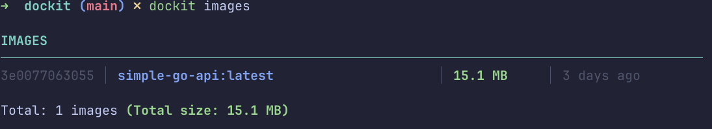

# Dockit 🐳

A simple, prettier wrapper for Docker CLI commands. Dockit enhances common Docker commands with beautiful, colorful terminal output while maintaining full compatibility with the standard Docker CLI.




Cleaner. Prettier. Still Docker.

## Philosophy

Dockit is a transparent wrapper around Docker. It makes common commands prettier, but for everything else, it simply passes through to the standard Docker CLI. If we haven't built out pretty formatting for a command yet, you'll get the traditional Docker response.

## Features

- **Pretty `docker ps`** - Beautiful, colorful container listings with status indicators and container IDs
- **Pretty `docker images`** - Enhanced image listings with formatted sizes and timestamps
- **Full Docker Compatibility** - All other Docker commands work exactly as they do with `docker`
- **Zero Configuration** - Works out of the box with your existing Docker setup
- **Clean Format** - No cluttered borders, just clean vertical dividers between columns

## Installation

### Prerequisites
- Go 1.24 or higher
- Docker daemon running

### Build from Source

```bash
git clone https://github.com/guevarez30/dockit.git
cd dockit
go build -o dockit
```

## Usage

Use `dockit` exactly like you would use `docker`:

```bash
# Pretty commands (enhanced output)
dockit ps                    # List running containers with colors
dockit ps -a                 # List all containers with colors
dockit images                # List images with pretty formatting

# All other commands pass through to docker
dockit run -d nginx          # Standard docker run
dockit build -t myapp .      # Standard docker build
dockit exec -it web bash     # Standard docker exec
dockit logs myapp            # Standard docker logs
```

### Command Reference

**Pretty Commands** (enhanced with colors and formatting):
- `dockit ps [-a]` - List containers with ID, name, status, image, ports, and uptime
- `dockit images` - List images with ID, repository:tag, size, and creation time

**Pass-through Commands** (standard Docker output):
- All other Docker commands work as normal: `run`, `build`, `exec`, `logs`, `pull`, `push`, `stop`, `start`, `rm`, `rmi`, etc.

### Pass-through Examples

```bash
# These work exactly like docker
dockit run -d -p 8080:80 nginx
dockit build -t myapp:latest .
dockit exec -it mycontainer bash
dockit logs -f myapp
dockit stop myapp
dockit rm myapp
```

### Upcoming Pretty Commands
- `dockit volume ls` - Pretty volume listing
- `dockit network ls` - Pretty network listing
- `dockit stats` - Enhanced real-time stats with progress bars
- `dockit logs` - Colorized log output with level highlighting

## Contributing

Contributions are welcome! Please feel free to submit a Pull Request.

See [.claude/plan.md](.claude/plan.md) for implementation guidelines.

## License

MIT License - see LICENSE file for details

## Why Dockit?

Docker's CLI output is functional but dense. Dockit makes it easier to scan and understand your Docker environment at a glance while maintaining 100% compatibility with the Docker CLI you know and love.
